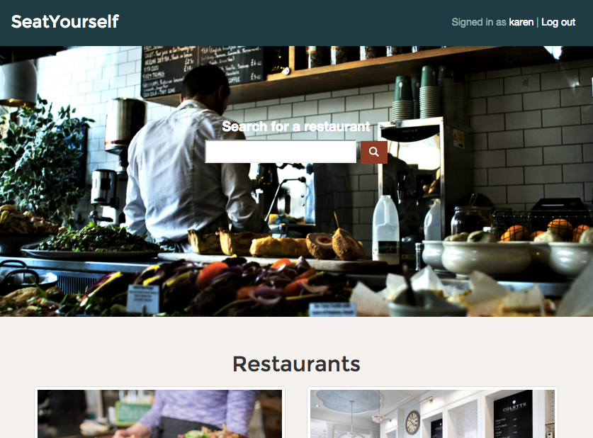

# SeatYourself

SeatYourself is a simple and easy-to-use restaurant reservation system. Built with
Ruby on Rails, JavaScript/jQuery, and HTML/CSS on the Bootstrap framework.



#### Contributors

Jonathan Alorda, Patrick Cruikshank, Natalie Doak, and Karen Ho.

#### Features

* Add restaurants and set up their capacity

* Search for restaurants by name

* Browse restaurants by tags, like "brunch" or "French"

* Place a reservation at a restaurant of your choice

* Rate and review restaurants

## Getting Started

If you have [bundler](https://github.com/bundler/bundler), starting SeatYourself is easy.

```sh
$ bundle install
$ rake db:migrate
```

## Limitations

SeatYourself is based on an assignment from the Bitmaker web development intensive program. Although restaurants can limit their capacity, they cannot set opening house, or limit the times of reservations. Reservations must also start on the hour, and last exactly one hour.

## Tests

SeatYourself has a few unit tests (written with the help of FactoryGirl) for its restaurant availability and ratings methods.

To run the tests:

```sh
$ rake
```

## Contact

Karen Ho – [@karenjho](https://twitter.com/karenjho)

[https://github.com/karenjho](https://github.com/karenjho)
